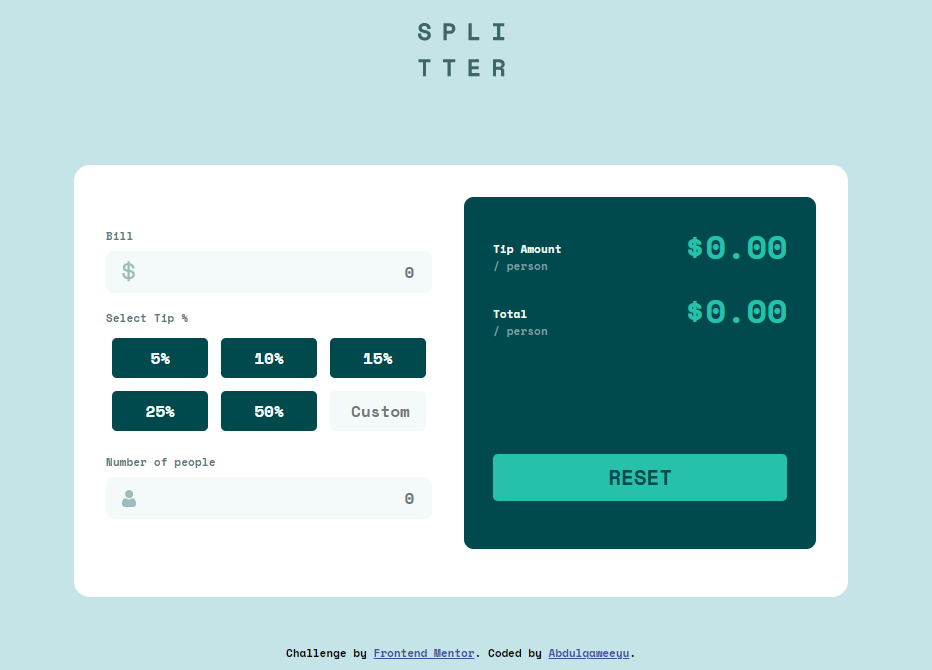
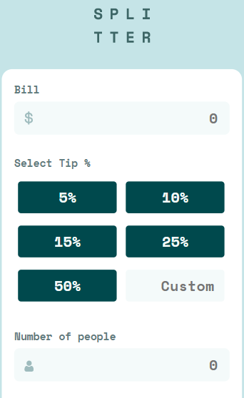
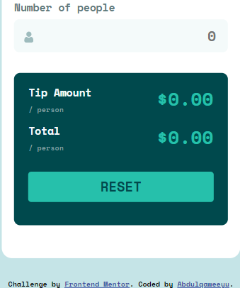

# Frontend Mentor - Tip calculator app solution

This is a solution to the [Tip calculator app challenge on Frontend Mentor](https://www.frontendmentor.io/challenges/tip-calculator-app-ugJNGbJUX). Frontend Mentor challenges help you improve your coding skills by building realistic projects.

## Table of contents

- [Overview](#overview)
  - [The challenge](#the-challenge)
  - [Screenshot](#screenshot)
  - [Links](#links)
- [My process](#my-process)
  - [Built with](#built-with)
  - [What I learned](#what-i-learned)
  - [Useful resources](#useful-resources)
- [Author](#author)


## Overview

### The challenge

Users should be able to:

- View the optimal layout for the app depending on their device's screen size
- See hover states for all interactive elements on the page
- Calculate the correct tip and total cost of the bill per person

### Screenshot






### Links

- Solution URL: [Solution URL](https://github.com/ABQ4539/Tip-calculator)
- Live Site URL: [Live site URL](https://abq4539.github.io/Tip-calculator/)

## My process

### Built with

- Semantic HTML5 markup
- CSS custom properties
- Flexbox
- CSS Grid
- Mobile-first workflow
- Vanilla JavaScript


### What I learned

I learnt many things while working on this project mostly with JavaScript. I learnt how to manipulate the HTML document by changing the content using JavaScript and how to change the style of the elements as well such as input fields and buttons when a condition is true. 
```js
peopleStyle.style.border = "none";
spanTitle.style.display = "none";
  if (tipAmount === 0 || tipAmountPerPerson === Infinity) {
      tipAmountValue.innerHTML = "Error"
      totalValue.innerHTML = "Error"
      peopleStyle.style.border = "2px solid red";
      spanTitle.style.display = "initial";
  }
```
I also learnt how to use CSS grid to style the layout of elements in a grid.
```css
.buttons-grid-container {
    display: grid;
    grid-template-columns: auto auto;
}
.grid-item {
    margin: 0.6rem 0.4rem;
}
```

### Useful resources

- [How to hide HTML5 number input's spin box](https://stackoverflow.com/questions/3790935/can-i-hide-the-html5-number-input-s-spin-box) - This helped me hide the number input's spin box.
- [Styling elements with JavaScript](https://www.w3schools.com/jsref/prop_style_bordercolor.asp) - This is a good site that helped me finally understand how to style borders and any other property in general with JavaScript.


## Author

- Frontend Mentor - [@ABQ4539](https://www.frontendmentor.io/profile/ABQ4539)


